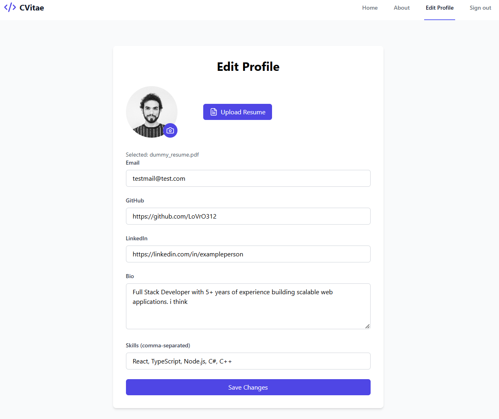

# A simple resume Web App  

A full-stack web application built with **React (TypeScript), Express, and MongoDB**.  

##  🚀 Running the Web App  

### Backend (Express)  
   ```sh
   cd CVitaeBackend
   npm install
   npm start
   ```

### Frontend (React TS)  
   ```sh
   cd CVitaeFrontend
   npm install
   npm run build  
   npm start
   ```  

### ⚠️ Prerequisites  
- Ensure **MongoDB** is installed or change DB_URL in .env in the backend.  

## 🔑 Admin Access  
- Admins have access to the **Edit Profile** page.  
- Admin accounts are **hardcoded** in the database.  

  

